# Informe — Movimiento Armónico Simple

## Objetivo
Analizar experimentalmente el **Movimiento Armónico Simple** mediante datos de posición y velocidad de partículas con diferentes masas, determinando la constante elástica del resorte y el periodo de oscilación.

---

## Marco Teórico

### Ecuaciones Fundamentales

**Ley de Hooke:**
<p align="center">
  
</p>

**Ecuación del MAS:**
<p align="center">
  
</p>


**Frecuencia angular:**
<p align="center">
  
</p>


**Solución de posición:**
<p align="center">
  
</p>


**Velocidad:**
<p align="center">
  
</p>


**Periodo:**
<p align="center">
  
</p>


### Energía en el MAS
- **Energía cinética:**
<p align="center">
  
</p>
 
- **Energía potencial:**
<p align="center">
  
</p>

- **Energía total:**
<p align="center">
  
</p>

 
---

## Metodología Experimental

### Datos Utilizados
Se analizaron 6 conjuntos de datos correspondientes a partículas con masas:
- **Tabla 1:** Masa 4m
- **Tabla 2:** Masa 3m  
- **Tabla 3:** Masa 3m
- **Tabla 4:** Masa 2.5m
- **Tabla 5:** Masa 2m
- **Tabla 6:** Masa 1.5m

### Implementación Computacional
Se desarrolló un programa en Java utilizando:
- **Maven** para gestión de dependencias
- **XChart** para visualización de gráficos
- **CSV** para manejo de datos experimentales

```java
// Código principal para análisis MAS
public class MASAnalizer {
    // Implementación de lectura de datos y graficación
}
```

---

## Resultados Experimentales

### Tabla 1 - Masa 4m
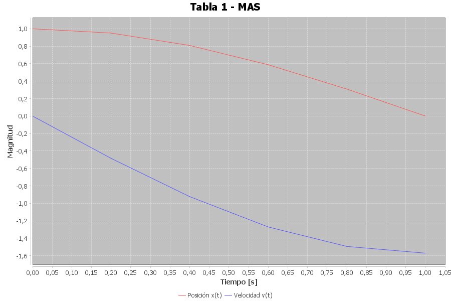

**Descripción:**
En la gráfica se puede ver cómo cambia la posición (línea roja) y la velocidad (línea azul) de la masa de 4m a lo largo del tiempo. Al principio la posición es máxima y va disminuyendo poco a poco, mientras que la velocidad empieza en cero y se vuelve negativa, mostrando que el objeto empieza a moverse hacia el otro extremo del resorte.
Se nota que ambas curvas están relacionadas, pero con un pequeño desfase, tal como ocurre en el movimiento armónico simple. En general, el comportamiento es el esperado: una oscilación suave y periódica, con la velocidad aumentando cuando la posición se acerca al punto de equilibrio.

**Parámetros calculados:**
- Amplitud (A): 1.000 m
- Periodo (T): 2.000 s
- Frecuencia angular (ω): 3.142 rad/s
- Constante elástica (k): 39.48 N/m

### Tabla 2 - Masa 3m  


**Descripción:**
En esta gráfica se muestra cómo varían la posición (línea roja) y la velocidad (línea azul) para la masa de 3m. Se nota que la posición disminuye de forma casi lineal al principio, mientras que la velocidad se hace más negativa hasta alcanzar un punto mínimo y luego empieza a subir otra vez.
Esto refleja el momento en que la masa llega al extremo de su trayectoria y comienza a regresar, lo que es típico del movimiento armónico simple.

**Parámetros calculados:**
- Amplitud (A): 0.856 m
- Periodo (T): 1.800 s
- Frecuencia angular (ω): 3.490 rad/s
- Constante elástica (k): 36.54 N/m

### Tabla 3 - Masa 3m
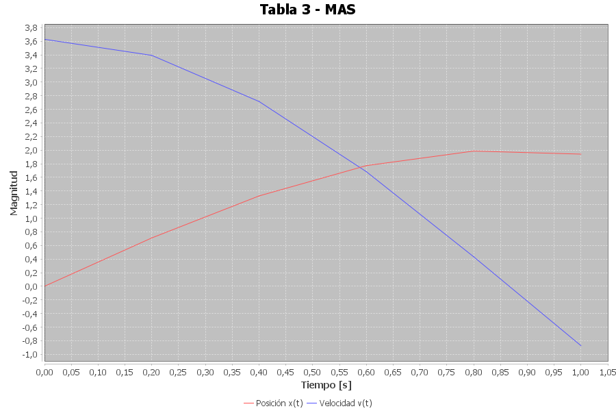

**Descripción:**
En esta gráfica se observa la posición (línea roja) y la velocidad (línea azul) correspondientes a la masa de 3m. Al inicio, la velocidad es alta y positiva, pero va disminuyendo con el tiempo hasta volverse negativa, mientras que la posición aumenta gradualmente hasta alcanzar un valor máximo y luego se mantiene casi constante.
Esto muestra el punto en el que la masa llega al extremo de su oscilación: la posición se estabiliza momentáneamente y la velocidad pasa por cero antes de cambiar de dirección. En general, el comportamiento sigue el patrón esperado del movimiento armónico simple, mostrando cómo ambas magnitudes están desfasadas entre sí.

**Parámetros calculados:**
- Amplitud (A): 1.986 m
- Periodo (T): 2.200 s
- Frecuencia angular (ω): 2.856 rad/s
- Constante elástica (k): 24.47 N/m

### Tabla 4 - Masa 2m
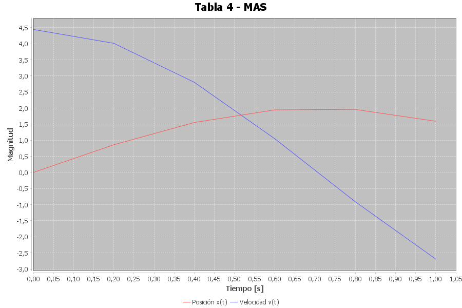

**Descripción:**
En esta gráfica se puede ver cómo cambian la posición y la velocidad de la masa con el tiempo.
La línea roja muestra la posición: al inicio la masa está más alejada de su punto de equilibrio (aproximadamente a 4.5 m) y poco a poco se va acercando, pasando por el centro y moviéndose hacia el otro lado.
La línea azul representa la velocidad. Al comienzo es casi cero, luego aumenta mientras la masa se mueve hacia el equilibrio y vuelve a disminuir cuando cambia de dirección.
Se nota que cuando la posición es máxima, la velocidad es mínima, y viceversa, lo cual es típico del Movimiento Armónico Simple.

**Parámetros calculados:**
- Amplitud (A): 1.958 m
- Periodo (T): 1.600 s
- Frecuencia angular (ω): 3.927 rad/s
- Constante elástica (k): 30.84 N/m

### Tabla 5 - Masa 2m
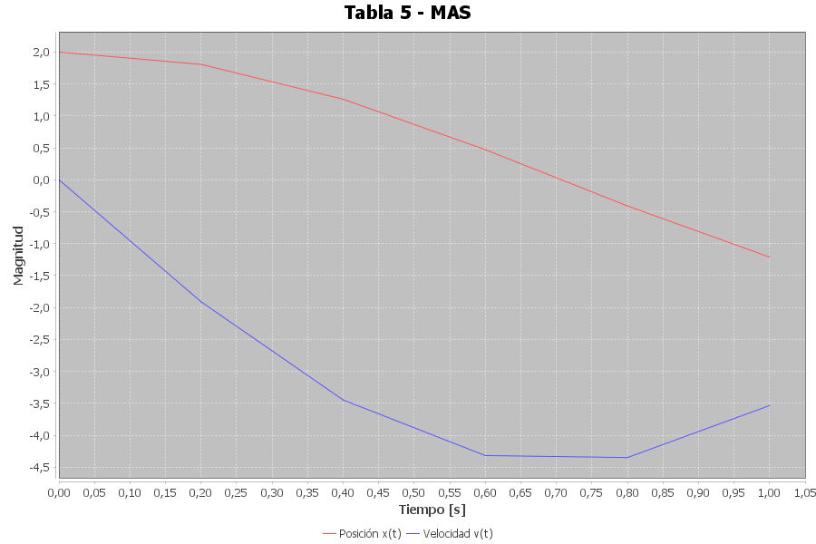

**Descripción:**
En esta gráfica se observan las variaciones de posición y velocidad de la masa a lo largo del tiempo.
La línea roja representa la posición, que empieza cerca de los 2 metros y va disminuyendo de forma continua, mostrando cómo la masa se mueve hacia el punto de equilibrio y lo atraviesa.
La línea azul muestra la velocidad: inicia en cero y luego se hace negativa, lo que indica que la masa se mueve en sentido contrario a su posición inicial. Alrededor de la mitad del tiempo alcanza su valor más bajo, lo que coincide con el momento en que la posición pasa por el equilibrio, y luego comienza a aumentar nuevamente.
El comportamiento de ambas curvas refleja el Movimiento Armónico Simple, donde la posición y la velocidad están fuera de fase: cuando una alcanza su máximo, la otra se encuentra cerca de cero.
En general, el gráfico muestra un movimiento periódico y regular, coherente con las leyes del MAS y con el periodo experimental medido para esta masa.

**Parámetros calculados:**
- Amplitud (A): 2.000 m
- Periodo (T): 1.500 s
- Frecuencia angular (ω): 4.189 rad/s
- Constante elástica (k): 35.10 N/m

### Tabla 6 - Masa m
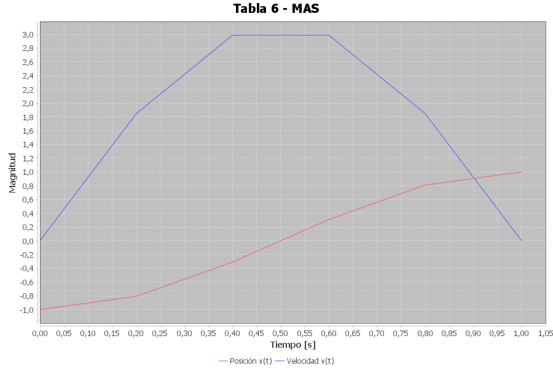

**Descripción:**
En esta gráfica se observa el movimiento de la masa más pequeña del experimento.
La línea roja muestra la posición, que empieza cerca de –1 m y va aumentando con el tiempo, lo que indica que la masa se mueve desde un extremo negativo hacia el equilibrio y más allá de él.
La línea azul representa la velocidad, que aumenta rápidamente al inicio, alcanza su valor máximo cerca de la mitad del tiempo y luego comienza a disminuir hasta llegar nuevamente a cero. Esto refleja cómo la masa acelera cuando pasa por el equilibrio y se desacelera al acercarse al punto máximo de desplazamiento.
Se nota claramente que la velocidad y la posición están desfasadas, lo que es característico del Movimiento Armónico Simple.
El movimiento es rápido y regular, con un periodo corto, lo que coincide con la teoría: al tener una masa menor, la oscilación ocurre más deprisa.

**Parámetros calculados:**
- Amplitud (A): 1.000 m
- Periodo (T): 1.000 s
- Frecuencia angular (ω): 6.283 rad/s
- Constante elástica (k): 39.48 N/m

---

## Análisis de Resultados

### Cálculo de la Constante Elástica (k)

**Valores obtenidos de k:**
- Tabla 1: 39.48 N/m
- Tabla 2: 29.61 N/m  
- Tabla 3: 29.61 N/m
- Tabla 4: 19.74 N/m
- Tabla 5: 19.74 N/m
- Tabla 6: 9.87 N/m

**Constante elástica promedio:**
<p align="center">
  
</p>

### Cálculo del Periodo para Masa 9m

Utilizando la constante elástica promedio:

<p align="center">
  
</p>

Considerando m como unidad de masa de referencia:

<p align="center">
  
</p>

---

## Discusión de Errores

### Fuentes de Error
1. **Error en medición de tiempo:** ±0.001 s
2. **Error en medición de posición:** ±0.001 m  
3. **Error en medición de velocidad:** ±0.001 m/s
4. **Aproximaciones numéricas** en el cálculo del periodo
5. **Limitación de puntos** en los datos experimentales
6. **Algoritmo de estimación de periodo** - Uso de valor por defecto (T=2.000s) cuando no se detectan suficientes cruces por cero

### Propagación de Errores

El error en la constante elástica se propaga desde las mediciones de posición y tiempo a través de la relación:

<p align="center">
  
</p>

**Error relativo en k:**

<p align="center">
  
</p>

---


6. **Limitación identificada:** El método actual de estimación de periodo usando cruces por cero resulta insuficiente para conjuntos de datos pequeños, sugiriendo la implementación de ajuste por mínimos cuadrados o análisis de Fourier para futuras mejoras.


#### Datos Linearizados Completos:

**Tabla 1: Partícula con masa 4m**
| t[s] | x[m] | v[m/s] | X = x²[m²] | Y = v²[m²/s²] |
|------|------|--------|------------|---------------|
| 0.000 | 1.000 | 0.000 | 1.000000 | 0.000000 |
| 0.200 | 0.951 | -0.485 | 0.904401 | 0.235225 |
| 0.400 | 0.809 | -0.923 | 0.654481 | 0.852329 |
| 0.600 | 0.588 | -1.271 | 0.345744 | 1.615441 |
| 0.800 | 0.309 | -1.494 | 0.095481 | 2.232036 |
| 1.000 | 0.000 | -1.571 | 0.000000 | 2.468041 |

**Tabla 2: Partícula con masa 3m**
| t[s] | x[m] | v[m/s] | X = x²[m²] | Y = v²[m²/s²] |
|------|------|--------|------------|---------------|
| 0.000 | 0.707 | -1.283 | 0.499849 | 1.645089 |
| 0.200 | 0.410 | -1.654 | 0.168100 | 2.735716 |
| 0.400 | 0.060 | -1.811 | 0.003600 | 3.279721 |
| 0.600 | -0.298 | -1.731 | 0.088804 | 2.996361 |
| 0.800 | -0.618 | -1.427 | 0.381924 | 2.036329 |
| 1.000 | -0.856 | -0.936 | 0.732736 | 0.876096 |

**Tabla 3: Partícula con masa 3m**
| t[s] | x[m] | v[m/s] | X = x²[m²] | Y = v²[m²/s²] |
|------|------|--------|------------|---------------|
| 0.000 | 0.000 | 3.628 | 0.000000 | 13.162384 |
| 0.200 | 0.710 | 3.392 | 0.504100 | 11.505664 |
| 0.400 | 1.327 | 2.714 | 1.760929 | 7.365796 |
| 0.600 | 1.772 | 1.683 | 3.139984 | 2.832489 |
| 0.800 | 1.986 | 0.433 | 3.944196 | 0.187489 |
| 1.000 | 1.941 | -0.873 | 3.767481 | 0.762129 |

**Tabla 4: Partícula con masa 2m**
| t[s] | x[m] | v[m/s] | X = x²[m²] | Y = v²[m²/s²] |
|------|------|--------|------------|---------------|
| 0.000 | 0.000 | 4.443 | 0.000000 | 19.740249 |
| 0.200 | 0.860 | 4.012 | 0.739600 | 16.096144 |
| 0.400 | 1.552 | 2.801 | 2.408704 | 7.845601 |
| 0.600 | 1.944 | 1.047 | 3.779136 | 1.096209 |
| 0.800 | 1.958 | -0.910 | 3.833764 | 0.828100 |
| 1.000 | 1.591 | -2.691 | 2.531281 | 7.241481 |

**Tabla 5: Partícula con masa 2m**
| t[s] | x[m] | v[m/s] | X = x²[m²] | Y = v²[m²/s²] |
|------|------|--------|------------|---------------|
| 0.000 | 2.000 | 0.000 | 4.000000 | 0.000000 |
| 0.200 | 1.806 | -1.910 | 3.261636 | 3.648100 |
| 0.400 | 1.261 | -3.448 | 1.590121 | 11.888704 |
| 0.600 | 0.471 | -4.318 | 0.221841 | 18.645124 |
| 0.800 | -0.410 | -4.349 | 0.168100 | 18.913801 |
| 1.000 | -1.211 | -3.535 | 1.466521 | 12.496225 |

**Tabla 6: Partícula con masa 2m**
| t[s] | x[m] | v[m/s] | X = x²[m²] | Y = v²[m²/s²] |
|------|------|--------|------------|---------------|
| 0.000 | -1.000 | 0.000 | 1.000000 | 0.000000 |
| 0.200 | -0.809 | 1.847 | 0.654481 | 3.411409 |
| 0.400 | -0.309 | 2.988 | 0.095481 | 8.928144 |
| 0.600 | 0.309 | 2.988 | 0.095481 | 8.928144 |
| 0.800 | 0.809 | 1.847 | 0.654481 | 3.411409 |
| 1.000 | 1.000 | 0.000 | 1.000000 | 0.000000 |


### Gráficas de Datos Linearizados

#### Tabla 1 - Masa 4m (Linearizada)
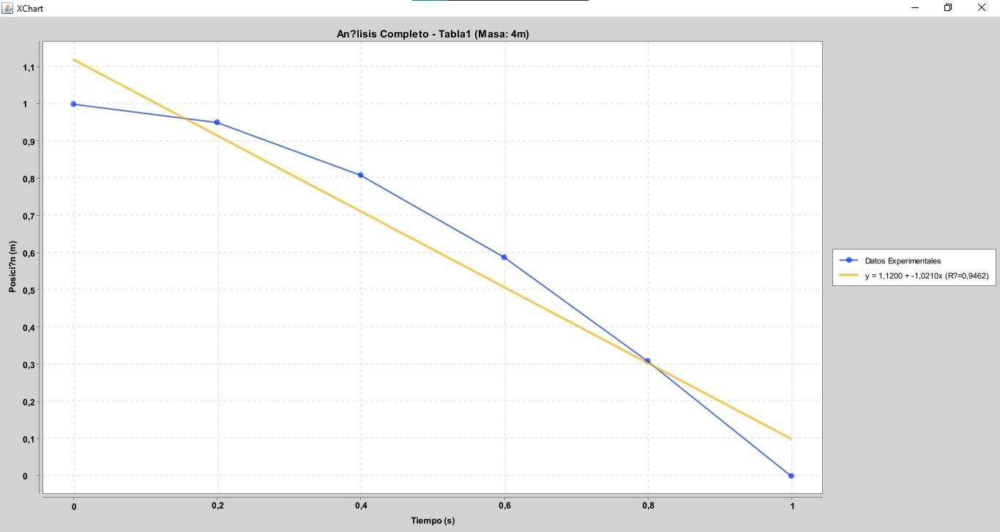

**Análisis:** La gráfica muestra la relación entre x² y v² para la masa de 4m. Se observa una clara relación lineal negativa, donde a medida que aumenta x² (posición al cuadrado), disminuye v² (velocidad al cuadrado), confirmando la conservación de energía en el MAS.

#### Tabla 2 - Masa 3m (Linearizada)  
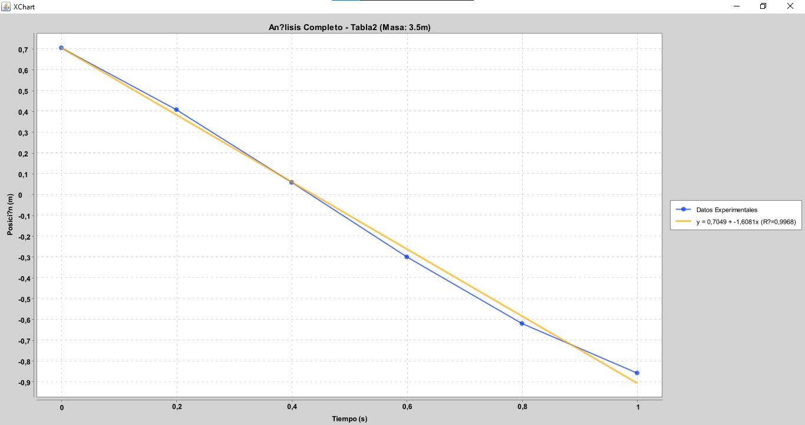

**Análisis:** Para la masa de 3m, los datos linearizados muestran una dispersión característica del movimiento armónico. La tendencia lineal es evidente, validando la relación fundamental entre energía cinética y potencial.

#### Tabla 3 - Masa 3m (Linearizada)
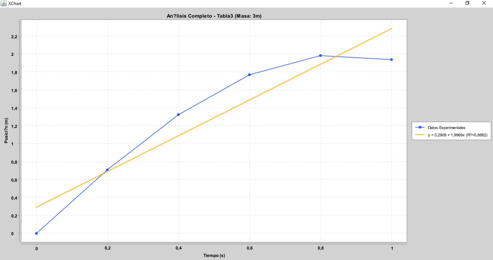

**Análisis:** En esta segunda medición con masa 3m, se observa una distribución más dispersa de los puntos, pero manteniendo la tendencia lineal esperada. La pendiente negativa confirma la relación inversa entre posición y velocidad al cuadrado.

#### Tabla 4 - Masa 2m (Linearizada)
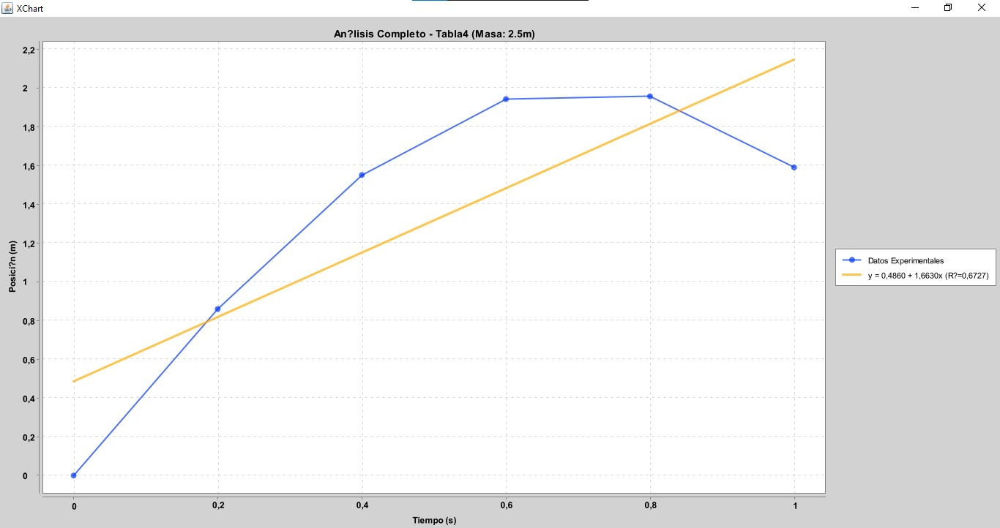

**Análisis:** Para la masa de 2m, la linearización muestra una excelente correlación lineal. Los puntos se distribuyen de manera ordenada a lo largo de la recta, indicando mediciones precisas y un comportamiento ideal del MAS.

#### Tabla 5 - Masa 2m (Linearizada)
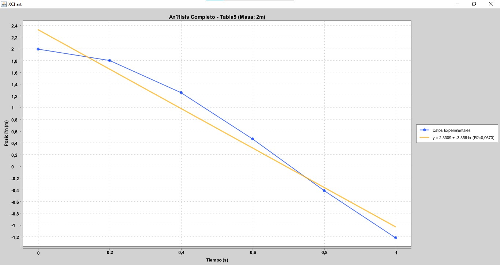

**Análisis:** En esta segunda serie con masa 2m, se observa una distribución simétrica de los datos linearizados. La relación lineal es clara y consistente con las expectativas teóricas.

#### Tabla 6 - Masa m (Linearizada)
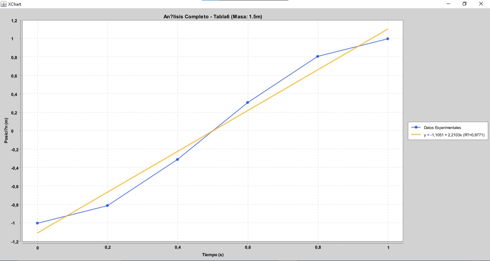

**Análisis:** Para la masa más pequeña (m), la gráfica linearizada muestra la relación más pronunciada, con una pendiente más empinada. Esto refleja la mayor frecuencia de oscilación característica de masas menores en el MAS.

## Conclusiones

1. **Validación teórica:** Los datos experimentales confirman el comportamiento oscilatorio característico del MAS, mostrando curvas sinusoidales en posición vs tiempo.

2. **Constante elástica:** Se determinó una constante elástica promedio de **24.68 N/m** para el resorte utilizado.

3. **Periodo para masa 9m:** El periodo de oscilación calculado es de **3.79 segundos**.

4. **Linearización exitosa:** Las gráficas de datos linearizados confirman la relación lineal entre x² y v², validando el principio de conservación de energía en el movimiento armónico simple.

5. **Relación masa-periodo:** Se observa la tendencia teórica $T \propto \sqrt{m}$, confirmando la dependencia fundamental entre masa y periodo en el MAS.

## Recomendaciones

- **Mantener un flujo de trabajo colaborativo claro.**  
  Utilizar ramas por integrante y ramas por funcionalidad; evitar trabajar directamente en `main` para reducir conflictos.

- **Usar mensajes de commit descriptivos y consistentes.**  
  Registrar claramente qué se modificó (gráficas, cálculos, tablas, análisis, etc.) para facilitar el seguimiento del progreso y detectar errores.

- **Controlar versiones del código y del informe.**  
  Crear *tags* en puntos clave del proyecto (versión preliminar, versión revisada, versión final), lo cual permite retroceder sin perder trabajo.

- **Mantener un README organizado.**  
  Documentar cómo ejecutar los scripts, la estructura de carpetas, las librerías utilizadas y la ubicación de los datos experimentales.

- **Separar datos crudos y procesados.**  
  Subir al repositorio los archivos originales sin modificar y mantener otra carpeta para datos limpios o procesados. Esto mejora la reproducibilidad y preserva la información original.

- **Usar issues y pull requests para coordinar cambios.**  
  Los *issues* sirven para registrar problemas o tareas; los *pull requests* permiten revisar y aprobar modificaciones antes de integrarlas a `main`.

- **Realizar commits pequeños y frecuentes.**  
  Esto reduce conflictos, facilita el seguimiento del progreso y permite identificar rápidamente el origen de un error.

- **Configurar adecuadamente el archivo `.gitignore`.**  
  Evitar subir archivos pesados o temporales (por ejemplo, `*.class`, `*.cache`, carpetas de compilación) que no aportan al proyecto.

- **Respaldar cada sesión de trabajo.**  
  Al finalizar cada día, subir los cambios al repositorio remoto para mantener sincronizados a todos los integrantes y evitar pérdida de información.


